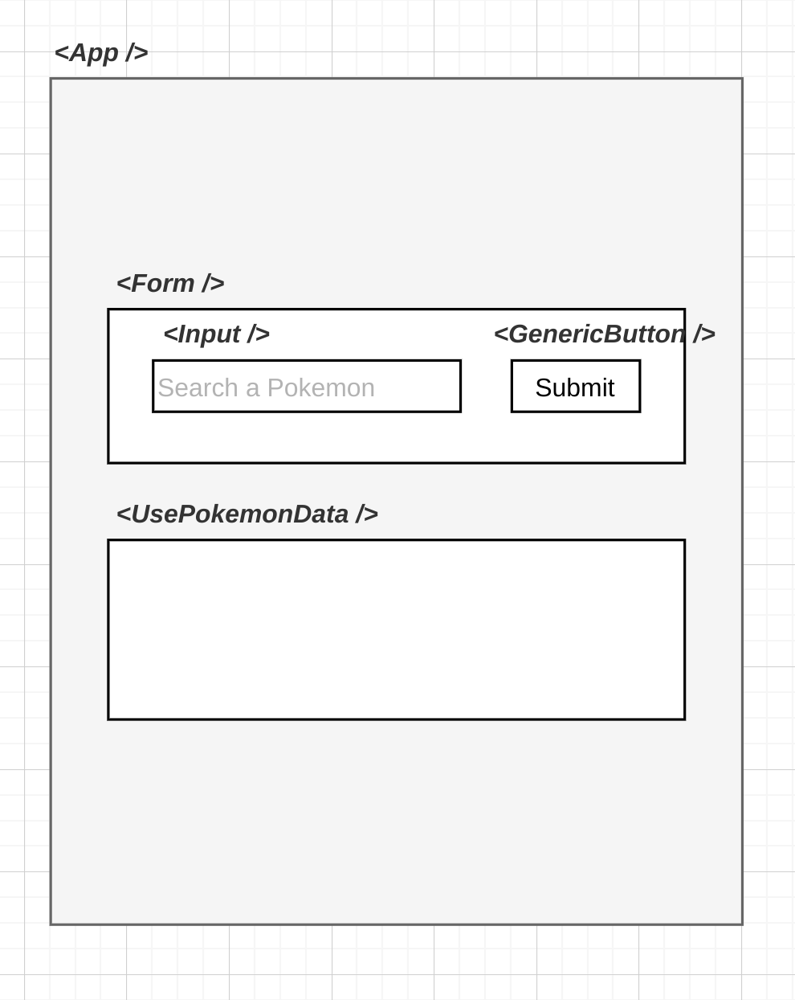
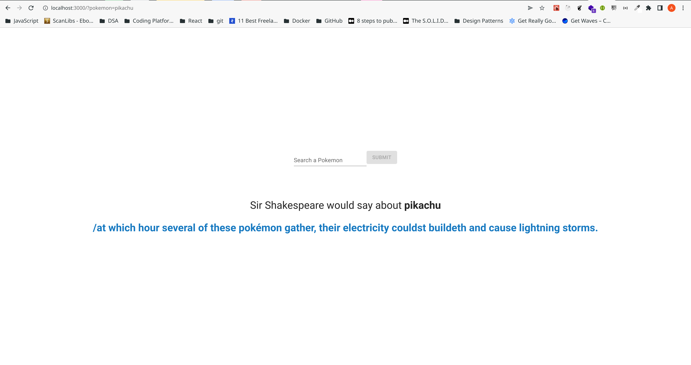
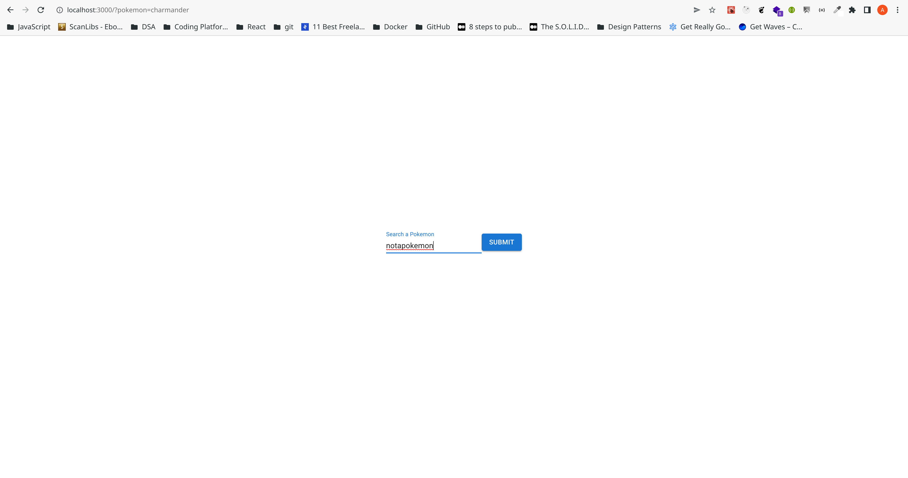
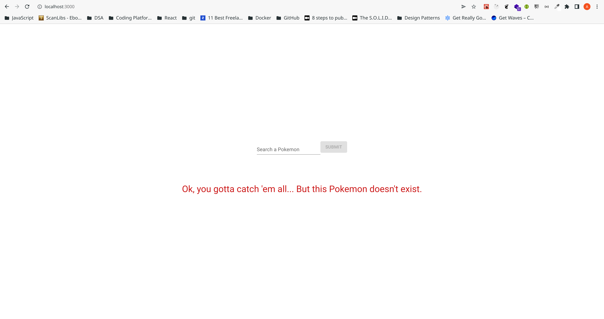
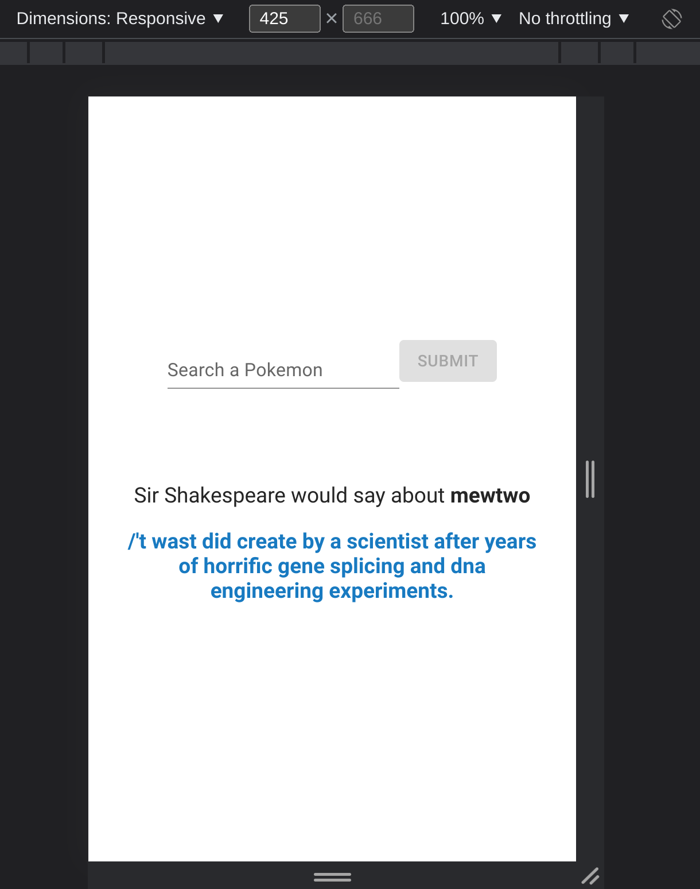
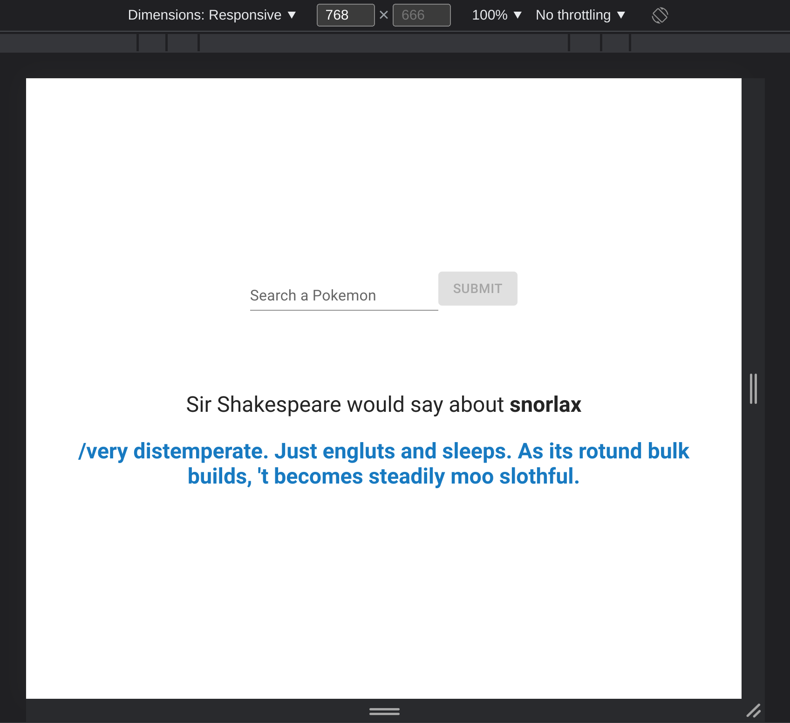

# true-layer-client

> A React app that serves as client-side for [true-layer-server](https://github.com/HereBeAndre/true-layer-server).

## General Information

> This project's structure was cloned from a template I created - [react-typescript-template](https://github.com/HereBeAndre/react-typescript-template) - which in turn was originally bootstrapped with [Create React App](https://github.com/facebook/create-react-app).

## Table of Contents

- [true-layer-client](#true-layer-client)
  - [General Information](#general-information)
  - [Table of Contents](#table-of-contents)
  - [Getting started](#getting-started)
    - [Pre-requisites](#pre-requisites)
    - [Installation](#installation)
    - [Available Scripts](#available-scripts)
    - [`npm start`](#npm-start)
    - [`npm test`](#npm-test)
    - [`npm run build`](#npm-run-build)
    - [`npm run eject`](#npm-run-eject)
  - [UI Architecture](#ui-architecture)
  - [Requirements](#requirements)
  - [Implementation and Features](#implementation-and-features)
    - [App State](#app-state)
    - [HTTP requests](#http-requests)
    - [Routing](#routing)
    - [Responsiveness](#responsiveness)
    - [TypeScript and schemas](#typescript-and-schemas)
  - [Screenshots](#screenshots)
  - [Room for Improvement](#room-for-improvement)
  - [License](#license)

## Getting started

### Pre-requisites

- Install [Node.js](https://nodejs.org/en/) version 14.17.5

### Installation

- Clone the repository via SSH

```
git clone git@github.com:HereBeAndre/true-layer-client.git
```

- Or clone it via HTTPS

```
git clone https://github.com/HereBeAndre/true-layer-client.git
```

- Install dependencies

```
cd true-client-client
npm install
```

The complete list of dependencies is included in `./package-lock.json`.

- Run the project

```
npm start
```

The app is available at http://localhost:3000

### Available Scripts

In the project directory, you can run:

### `npm start`

Runs the app in the development mode.\
Open [http://localhost:3000](http://localhost:3000) to view it in the browser.

The page will reload if you make edits.\
You will also see any lint errors in the console.

### `npm test`

Launches [Jest](https://www.npmjs.com/package/jest) as test runner in the interactive watch mode.\
React components are tested with [React Testing Library](https://www.npmjs.com/package/@testing-library/react).

Test files are created under `./src/__tests__` folder.

### `npm run build`

Builds the app for production to the `build` folder.\
It correctly bundles React in production mode and optimizes the build for the best performance.

The build is minified and the filenames include the hashes.\
Your app is ready to be deployed!

See the section about [deployment](https://facebook.github.io/create-react-app/docs/deployment) for more information.

### `npm run eject`

**Note: this is a one-way operation. Once you `eject`, you can’t go back!**

If you aren’t satisfied with the build tool and configuration choices, you can `eject` at any time. This command will remove the single build dependency from your project.

Instead, it will copy all the configuration files and the transitive dependencies (webpack, Babel, ESLint, etc) right into your project so you have full control over them. All of the commands except `eject` will still work, but they will point to the copied scripts so you can tweak them. At this point you’re on your own.

You don’t have to ever use `eject`. The curated feature set is suitable for small and middle deployments, and you shouldn’t feel obligated to use this feature. However we understand that this tool wouldn’t be useful if you couldn’t customize it when you are ready for it.

## UI Architecture

&nbsp;&nbsp;

## Requirements

- [x] Search field where you can type the Pokémon name;
- [x] Show the Shakespearean description of the Pokémon;
- [x] Basic styling - responsiveness included;

## Implementation and Features

### App State

> - No state management library was used;
> - Heavy-lifting is done in `App.tsx`, therefore the majority of hooks is used there;
> - I got away with using `useState` hook as I didn't need to share state with bottom-up / sibling components;
> - Data is shared top-down between components via props.

### HTTP requests

> - HTTPS requests are made with [axios](https://axios-http.com/).

### Routing

> - Routing is handled with `react-router-dom`;
> - Search params in URL are updated via `useSearchParams()` hook provided by `react-router-dom`.

### Responsiveness

> - The app is fully responsive.

### TypeScript and schemas

> - Schemas are defined inside `./src/schemas` folder.

> WIP

## Screenshots

&nbsp;&nbsp;
&nbsp;&nbsp;
&nbsp;&nbsp;
&nbsp;&nbsp;


## Room for Improvement

Todo:

- [ ] Programmatically redirect user to main page if a non-existing route is visited;
- [ ] Add RegExp to validate user input in text field - i.e. support both latin and non-latin characters;
- [ ] Improve error handling - i.e. when backend is down;
- [ ] Implement environment variables management for production, development and testing envs.

Known bugs:

- List bugs here

## License

This project is licensed under the terms of the MIT license.
